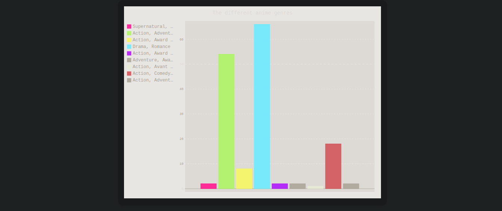

# Django Pygal Chart Visualization

This project is a simple web application that uses the AIME dataset  
to generate various interactive plots using the Python Pygal library.

It leverages Django for the backend and integrates Pygal charts into a responsive HTML template.  
The charts are rendered as SVGs and provide interactive tooltips for better data understanding.

The goal of this project is to visually explore and present insights from the AIME dataset  
in a clean and accessible way through dynamic, embeddable charts.

All visualizations are generated server-side in Python and embedded in a styled frontend.  
The UI is responsive and works across different screen sizes.

Feel free to modify or extend the dataset and charts to suit your own needs.

---

**Created by Yassine Ghilani**
